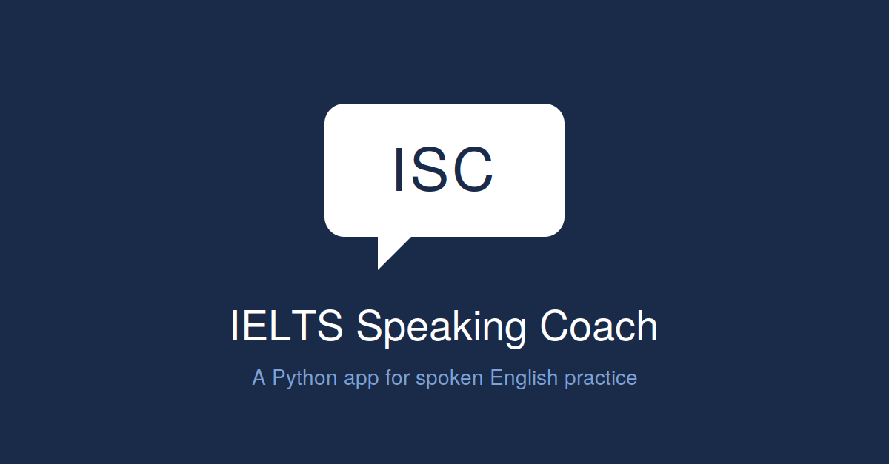

# IELTS Speaking Coach

A Python application that simulates the IELTS Speaking exam, helping users
practice for the test on their own — without needing a partner or a paid
subscription.

<p align="center">
  
</p>

## Why I built this

I'm an international student preparing for English proficiency tests, and most
IELTS speaking prep tools either require a study partner or sit behind a
paywall. So I built my own — a simple terminal app that runs the full speaking
exam structure on my schedule, with realistic timing and recorded responses
I can play back and review.

This is also my first step toward turning it into an end-to-end ML application
(see the [Roadmap](#roadmap) below).

## Features

- **All three IELTS Speaking parts** — practice questions structured exactly
  like the real exam:
  - Part 1: Short personal questions
  - Part 2: Long-turn cue card with 1-minute prep
  - Part 3: Discussion questions tied to Part 2's topic
- **Built-in timers** for each part, matching official IELTS timing
- **Audio recording** — your spoken answers are saved so you can listen back
  and self-evaluate
- **CLI interface** — lightweight, no setup beyond Python

## Tech stack

- Python 3
- Audio recording library (e.g. `sounddevice` / `pyaudio`)
- Standard library: `time`, `random`, `os`

## How to run

```bash
# Clone the repo
git clone https://github.com/madferuz/IELTS-Speaking-Coach.git
cd IELTS-Speaking-Coach

# Install dependencies
pip install -r requirements.txt

# Run the app
python ielts_speaking.py
```

Recorded audio is saved locally so you can review your responses after each
practice session.

## Roadmap

This project is a foundation. I'm planning to extend it into a full ML-powered
speaking coach:

- [ ] **Speech-to-text** — automatic transcription of recorded answers using
      OpenAI Whisper
- [ ] **LLM-based feedback** — evaluate grammar, vocabulary range, and
      coherence using a language model
- [ ] **Pronunciation scoring** — a custom ML model trained to estimate
      pronunciation quality
- [ ] **Progress tracking** — store sessions and visualize improvement over
      time
- [ ] **Web interface** — move beyond the CLI for easier daily use

## About me

I'm an Integrated Systems Engineering student at Inha University on a
deliberate path toward Machine Learning Engineering. This project is part of
how I'm bridging coursework into applied ML.

Connect with me on [LinkedIn](https://www.linkedin.com/) or follow my work
here on GitHub.

## License

MIT — see [LICENSE](LICENSE).
